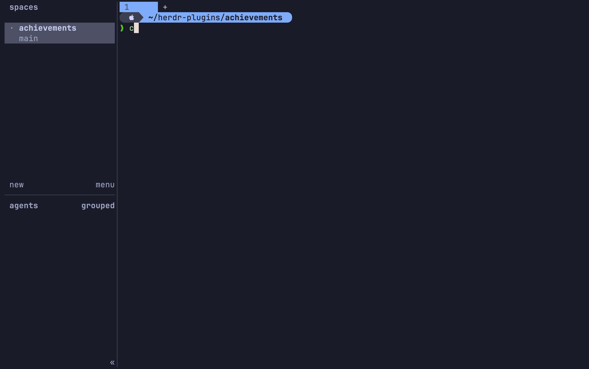

<p align="center">
  
</p>

<h1 align="center">Herdr Achievements</h1>

<p align="center">
  <strong>Turn everyday agent milestones into tiny terminal celebrations.</strong>
</p>

<p align="center">
  A playful Herdr plugin that unlocks achievements as your AI agent herd gets to work.
</p>

<p align="center">
  <a href="#install">install</a> ·
  <a href="#trophy-room">trophy room</a> ·
  <a href="#private-by-design">privacy</a> ·
  <a href="#try-the-demo">demo</a> ·
  <a href="#development">development</a>
</p>

<p align="center">
  <a href="https://github.com/SerHappy/herdr-achievements/actions/workflows/ci.yml"></a>
  <a href="https://github.com/SerHappy/herdr-achievements/releases"></a>
  
  
  <a href="LICENSE"></a>
</p>

<p align="center">
  
</p>

## Your herd deserves trophies

Herdr already tells you what your agents are doing. Herdr Achievements makes those
moments feel a little more alive.

Install it, work as usual, and achievements unlock automatically when your herd
reaches a new milestone.

No prompts are read. No code is inspected. Nothing is sent over the network.

## Trophy Room

| Achievement | How to unlock |
| --- | --- |
| **FIRST HOOF** | Let the first agent join your herd. |
| **FIRST DELIVERY** | Finish an agent turn. |
| **UNSTUCK** | Help an agent return from `blocked` to `working`. |
| **DOUBLE TROUBLE** | Have two agents working at the same time. |
| **FULL HERD** | Have three agents working at the same time. |

Open the Trophy Room at any time to browse the five illustrated achievements,
their unlock conditions, progress, and unlock timestamps. Newly unlocked
trophies get a short pixel-art reveal the next time you open it.

Use `↑`/`↓` or `j`/`k` to select a trophy, `Enter` or `Space` to replay its
reveal, and `Esc` or `q` to close. The layout becomes a compact single card in
narrow popups.

When an achievement unlocks, Herdr shows a native notification:

> 🏆 **Achievement unlocked**<br>
> FULL HERD — Three agents working at once

## Install

Requires Herdr 0.7.5+. Go is only required for development from source.

Installation downloads the matching prebuilt binary from GitHub Releases and
verifies its SHA-256 checksum before installing it.

```sh
herdr plugin install SerHappy/herdr-achievements --yes
```

Open your achievements:

```sh
herdr plugin action invoke open --plugin herdr-achievements
```

Or give the collection its own keybinding:

```toml
[[keys.command]]
key = "prefix+a"
type = "plugin_action"
command = "herdr-achievements.open"
description = "open achievements"
```

## Private by design

Herdr Achievements only listens to Herdr lifecycle events.

It stores locally:

* unlocked achievement IDs;
* unlock timestamps;
* IDs of achievements already shown in the Trophy Room;
* current pane statuses;
* peak concurrent agent count.

It does not read or store prompts, terminal output, source code, filenames,
repository names, or agent conversations.

## Try the demo

Run the interactive popup with a temporary completed collection:

```sh
./scripts/demo.sh
```

The demo does not modify your real achievement progress and requires no
dependencies beyond Go. Run it in a terminal; press any key through the
initial reveals, then `q` to close.

## Development

To build from source, install Go 1.26+.

```sh
go test ./...
go vet ./...
go build -o bin/herdr-achievements ./cmd/herdr-achievements
herdr plugin link .
```

## License

MIT
